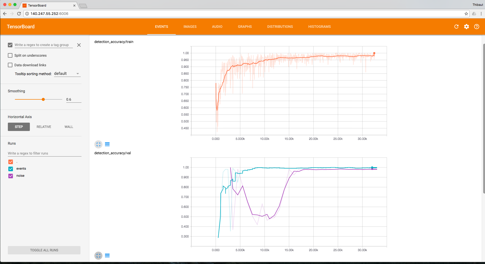
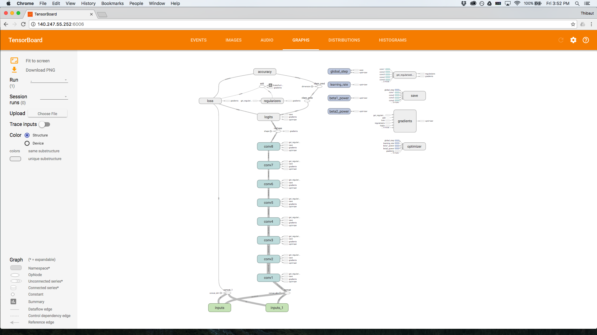

ConvNetQuake
=============

Perol., T, M. Gharbi and M. Denolle. Convolutional Neural Network for Earthquake detection and location. [preprint arXiv:1702.02073](https://arxiv.org/abs/1702.02073), 2017.

## Installation
* Download repository
* Install dependencies: `pip install -r requirements.txt`
* Add directory to python path: `./setpath.sh`
* Run tests: `./runtests.sh` (THIS NEEDS TO BE EXTENDED)
* Download the [data](https://www.dropbox.com/sh/3p9rmi1bcpvnk5k/AAAV8n9VG_e0QXOpoofsSH0Ma?dl=0) (roughly 70 Gb) and symlink to `data` 
`ln -s data Downloads/data`
* Download the [pre-trained models](https://www.dropbox.com/sh/t9dj8mmfx1fmxfa/AABSJQke8Ao6wfRnKMvQXipta?dl=0) and symlink to `models` 
`ln -s models Downloads/models`

## Data

ConvNetQuake is trained on data from Oklahoma (USA). 
The continuous waveform data and earthquake catalog are publicly available at https://www.iris.edu/hq/ and http://www.ou.edu/ogs.html

The `data` directory contains:
* `streams`: 2.5 years of monthly streams from GSOK029 and GSOK027 in .mseed 
* `catalogs`: earthquake catalogs the OGS (years 2014 to 2016) and from Benz et al. 2015 (Feb. to Sept. 2014)
* `6_clusters`: windows used for training and testing of ConvNetQuake with 6 geographic areas
* `50_clusters`: windows used for training and testing of ConvNetQuake with 50 geographic areas
* `known_template`: template T_1 used to generate synthetic data 
* `unknown_template`: template T_2 used to generate synthetic data 
* `synth`: directory of synthetic data for testing 

## Trained models

The directory `models` contains:
* `convnetquake`: trained model for 6 geographic areas 
* `50_clusters`: trained model for 50 geographic areas 
* `synth`: trained model on synthetic data

## 1 - What will you find in this repository ?

ConvNetQuake is a convolutional neural network that detect and locate events from a single waveform.
This repository contains all the codes used to write our paper. 
For each step, we provide the commands to run.

## 2 - Train ConvNetQuake on a dataset

Steps to train the network on a dataset of waveforms:

- Use a catalog of located events and partition them into clusters. This create a new catalog of labeled events. The script is in `bin/preprocess`.
- Load month long continuous waveform data. Preprocess them (mean removal, normalization). Use the catalog of labeled events to create event windows from the continuous waveform data. Use a catalog to create noise windows from continuous waveform data. The codes are in `bin/preprocess`.
- Train ConvNetQuake on the training windows, visualize of the training and evaluate on a test windows. The codes are in `bin/`.

Sections 2.1, 2.2 and 2.3 are required to reproduce the windows in `data/6_clusters/detection`
Section 2.4 for training and testing of the network, also provided in `models/convnetquake`

### 2.1 - Partition earthquakes into clusters

Load the OGS catalog. 
Filter to keep the events located in the region of interest and after 15 February 2014. 
To partition the events into 6 clusters using K-Means, run:

```shell
./bin/preprocess/cluster_events --src data/catalogs/OK_2014-2015-2016.csv\
--dst data/6_clusters --n_components 6 --model KMeans
```

This outputs in `data/6_clusters`:
* `catalog_with_cluster_ids.csv`: catalog of labeled events
* `clusters_metadata.json`: number of events per clusters. 

The code also plots the events on a map. 
The colored events are the training events, the black events are the events in the test set (July 2014).

The cluster labels range from 0 to M-1 with M the number of clusters chosen with `--n-components`. 

### 2.2 Create labeled windows of events

Load a directory of month long streams and a catalog of labeled events. 
The script preprocess the month long streams (remove the mean, normalization). 
Using the origin time of the cataloged events and a mean seismic velocity between the station and the event location, we create 10 second long event windows.

```shell
./bin/preprocess/create_dataset_events.py --stream_dir data/streams\
--catalog data/6_clusters/catalog_with_cluster_ids.csv \
--output_dir data/6_clusters/events \
--save_mseed True --plot True
```

This create tfrecords containing all the event windows. 
Pass `—-save_mseed` to save the windows in .mseed. Pass `—-plot` to save the events in .png.

`data_augmentation.py` adds Gaussian noise and can stretch or shift the signal to generate new tfrecords. 

```shell
./bin/preprocess/data_augmentation.py --tfrecords data/6_clusters/events \
--output data/6_clusters/augmented_data/augmented_stetch_std1-2.tfrecords \
--std_factor 1.2
```

You can pass various flags: `--plot` plot the generated windows, `-—compress_data` compress the signal, `-—stretch_data` stretch the signal, `-—shift_data` shifts the signal. 

In Perol et al., 2017 we only add Gaussian noise. 
The other data augmentation techniques do not improve the accuracy of the network.

### 2.3 Create windows of noise

Load one month long stream and a catalog, preprocess the stream and create noise windows labeled with -1. 

```shell
./bin/preprocess/create_dataset_noise.py \
--stream_path data/streams/GSOK029_8-2014.mseed \
--catalog data/catalogs/Benz_catalog.csv \
--output_dir data/noise_OK029/noise_august
```

This generates 10 second long windows when there is no event in the catalog. 
Check the flags in the code if you want to change this. 
`-—max_windows` controls the maximum number of windows to generate. 
The `-—plot` and `—-save_mseed` are available.

Note that in the case we do not account for the travel time because the detection times in Benz et al. 2015 correspond to the detected seismogram signal.

### 2.4 Train ConvNetQuake and monitor the accuracy on train and test sets

We split the tfrecords of windows for training and testing. The training set has two directories: 
`positive` containing the event windows and `negative` containing the noise windows.

To train ConvNetQuake (GPU recommended):

```shell
./bin/train --dataset data/6_clusters/train --checkpoint_dir output/convnetquake --n_clusters 6
```

This outputs checkpoints with saved weights and tensorboard events in the directory given by the `checkpoint_dir` flag.
The checkpoints are named after the number of steps done during training. 
For example `model-500` correspond to the weights after 500 steps of training. 
The configuration parameters (batch size, display step etc) are in `quakenet/config.py`. 

The network architecture is stored in `quakenet/models.py`. 

Note that we also provide the trained model in `models/convnetquake`.

During training, there are two things to monitor: the accuracy on the noise windows and the accuracy on event windows (CPUs are fine here). 
In both scripts, pass an integer in seconds to `--eval_interval` to set the time between each evaluation.  

```shell
./bin/evaluate --checkpoint_dir output/convnetquake/ConvNetQuake \
--dataset data/6_clusters/test_events \
--eval_interval 10 --n_clusters 6 \
--events
```

```shell
./bin/evaluate --checkpoint_dir output/convnetquake/ConvNetQuake \
--dataset data/6_clusters/test_noise --eval_interval 10 \
--n_clusters 6 --noise
```

You can visualize the accuracy on the train and test set while the network is training. 
The accuracy for detection and for location is implemented. Run:

```shell
tensorboard --logdir output/convnetquake/ConvNetQuake
```



You can also visualize the network architecture with tensorboard



## 3 - Detecting and locating events in continuous waveform data

There are two methods for detecting events from continuous waveform data. 
The first one is relatively slow, it loads a .mseed and generate windows. While the windows are generated they are fed to ConvNetQuake that makes the classification. 
A faster method does the classification from tfrecords. First windows, a generated and saved into tfrecords. Then the tfrecords are analyzed and classified by ConvNetQuake to create a catalog of events.

This second methods analyze one month of data in 4 min on a MacbookPro.

### 3.1 From .mseed

To create 10 second long windows with a 1 second offset and classify them, run:

```shell
./bin/predict_from_stream.py --stream_path data/streams/GSOK029_7-2014.mseed \
--checkpoint_dir models/convnetquake --n_clusters 6 \
--window_step 11 --output output/july_detections/from_stream \
--max_windows 8640
```

### 3.2 From tfrecords (faster, 4  min for 1 month of continuous data)

First, the windows are generated from a .mseed and stored into a tfrecords.

```shell
./bin/preprocess/convert_stream_to_tfrecords.py \
--stream_path data/streams/GSOK029_7-2014.mseed \
--output_dir  data/tfrecord \
--window_size 10 --window_step 11 \
--max_windows 5000
```

See the code for a documentation on the flags to pass.
This code can be parallelized easily to speed up the process.

Then, the detection from the windows stored in tfrecords are made with

```shell
./bin/predict_from_tfrecords.py \
--dataset data/tfrecords_continuous_detection/july.tfrecords \
--checkpoint_dir models/convnetquake \
--n_clusters 6
--max_windows 2678400
--output output/july_detections
```
Check the flags for more options.

## 4 - Visualization of data

The codes for vizualization can be found in `bin/viz`.

### 4.1 - Print the cluster Id and number of events

```shell
./bin/viz/print_clusterid_from_tfrecords.py \
--data_path data/agu/detection/train/positive \
--windows 40000
```

### 4.2 - Visualize windows from tfrecords

```shell
./bin/viz/plot_windows_from_tfrecords.py \
--data_path data/tfrecords/GSOK029_2-2014 \
--output_path output/viz --windows 100
```

Load tfrecords from a directory and plot the windows.

### 4.3 - Plot events from a .mseed stream

```shell
./bin/viz/plot_events_in_stream.py \
--catalog data/6_clusters/catalog_with_cluster_ids.csv  \
--stream data/streams/GSOK029_7-2014.mseed \
--output check_this_out/events_in_stream \
--with_preprocessing
```

Load a .mseed with a catalog and plot the windows of events.

### 4.4 - Visualize mislabeled windows

To visualized the mislabeled windows from a net on a probabilistic map:

```shell
./bin/viz/misclassified_loc.py \
--dataset data/mseed_events \
--checkpoint_dir models/convnetquake \
--output wrong_windows --n_clusters 6
```

## 5 - Generate a synthetic stream/catalog pair

- To generate 3600s of synthetic signal do:

```shell
./bin/create_synthetics --templates_dir data/streams/templates/\
--output_path data/synth --trace_duration 3600
```

This will output a .mseed stream and a .csv catalog to `data/synth.`
The signal is a a white gaussian noise. Events are generated randomly with 
a uniform distance between events sampled from [1min, 1h]. These are inserted
as a scaled copy of the template event

`templates_dir` should contain .mseed files with individual source templates e.g.
`templates_dir/templates01.mseed`, `templates_dir/templates02.mseed` , etc.

You can use this data as any other dataset/catalog pair to generate .tfrecords.


6 - Template matching method
------------------------
To train the template matching method (find the best beta parameter) on a
training set (one stream, one template, one catalog) and perform a test on a
test set ang get the score:

```shell
./bin/template_matching --train_data_path data/synth/stream.mseed \
--train_template_path data/streams/template_0.mseed \
--train_catalog_path data/synth/catalog.csv \
--test_data_path data/synth/stream.mseed \
--test_template_path data/streams/template_0.mseed \
--test_catalog_path data/synth/catalog.csv
```
It is possible to avoid training and only test on a stream. In this case beta
= 8.5. Run

```shell
./bin/template_matching --test_data_path data/synth/stream.mseed \
--test_template_path data/streams/template_0.mseed \
--test_catalog_path data/synth/catalog.csv
```


7 - Codebase
--------

Stream and catalog loaders are in `quakenet/data_io.py`.

`quakenet/data_pipeline.py` contains all the
preprocessing/conversion/writing/loading of the data used by the
network.

`quakenet/synth_data.py` contains the code that generates synthetic data from
a set of templates 

`quakenet/models.py` contains the tensorflow code for the architecture of ConvNetQuake

Tensorflow base model and layers can be found in `tflib` repository.
